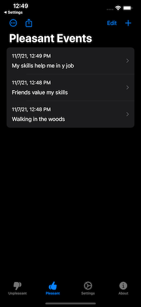
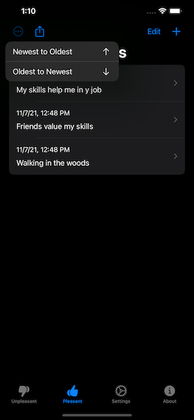
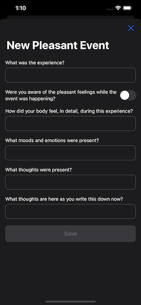
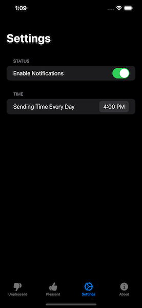
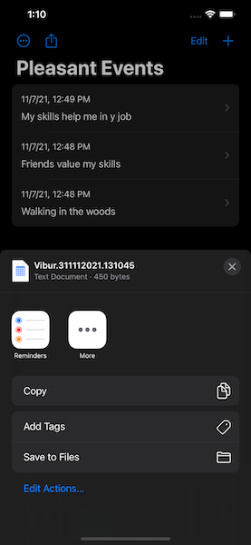

# Vibur

## Unpleasant and pleasant events calendar

There are no good or bad emotions, events happening in your life could be pleasant or unpleasant. This app will help you to be aware of an unpleasant event at the time it is happening. You will find some simple questions about your feelings and emotions, use them to focus your awareness on the details of the experience as it is happening. Write it down later. This app is a great supportive tool if you are in a therapy as you can export the full list of your recorded events (both pleasant and unpleasant), send to your email and show on your next therapy session.

[AppStore](https://apps.apple.com/us/app/vibur/id1592169625)